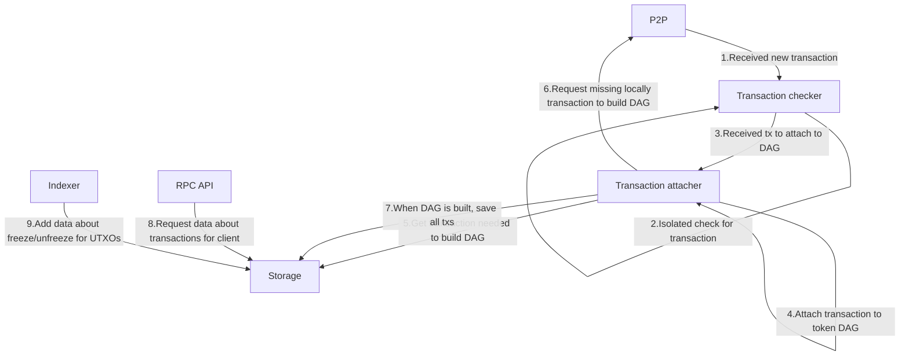

# LRC-20 Protocol

## LRC-20 protocol

The LRC-20 standard embeds additional information into Bitcoin transactions by tweaking public keys in Bitcoin outputs, enabling a novel, compact, and efficient approach for tokenized assets to be issued and transferred on Bitcoin and Lightning. LRC-20 nodes communicate on a peer-to-peer layer in order to recognize and validate LRC-20 transactions. Due to the simplicity and standardization of the key-tweaking mechanism, LRC-20 tokens can be seamlessly ported onto the Lightning Network, delivering faster and cheaper LRC-20 transactions. LRC-20 transaction amounts can be blinded for additional privacy, and issuers can implement freezing capabilities if they choose to.

Please refer to the [white paper](https://github.com/akitamiabtc/LRC-20/) on the technical design of the LRC-20 protocol.

## Nomenclature & Glossary

You will see the following keywords used throughout the repo.

* YUV: the nickname of the LRC-20 protocol
* Luma: the token amount, i.e. $Y$
* Chroma: the token type (the issuer's pubkey), i.e. $UV$
* Pixel: the token amount and token type information tuple to be embedded into the tweaked key
* Pixel Key: the tweaked key with $Y, UV, pk_b$ via $$hash\left(hash\left(hash(Y), UV\right), pk_b\right)*G + pk_b$$
* Pixel Proof: the $(Y, UV, pk_b)$-tuple

## Playground

To try out YUV, you can start up and run test environment with bitcoin regtest and few nodes setup. The instruction is located [here](./infrastructure/README.md). `yuv-cli` instruction is [here](./apps/cli/README.md).

**Alpha version, use at your own risk.**

## Architecture

Before we dive deep into architecture, there is a component that works like glue to connect all our components. It's an `Event bus`. All communication, except the communication to storage goes through the `Event bus`. 

Communication:
* [Bitcoin client](./crates/bitcoin-client/) - asynchronous wrapper on top of `bitcoincore-rpc`.
* [Controller](./crates/controller/) - message handler for P2P and RPC.
* [P2P](./crates/p2p/) - bitcoin P2P to broadcast YUV data (and in future, get all data from bitcoin through P2P).
* [RPC api](./crates/rpc-api/) - description of RPC api in Rust traits. Used to generate RPC client for wallets and as specification for backend implementation.
* [RPC server](./crates/rpc-server/) - implementation of RPC api.

Event bus:
* [Event bus](./crates/event-bus/) and [Event bus macros](./event-bus-macros/) - event bus implementation, utility crate which provides a simple interface for managing event channels between internal services. It provides you the ability to create the `EventBus` instance which can be used to publish events and subscribe to them.

Storage:
* [Storage](./crates/storage/) - Provides traits and implementations of storage for YUV transactions.
* [Indexers](./crates/indexers/) - indexer for bitcoin blocks for YUV protocol needs.

Transactions
* [Devkit](./crates/dev-kit/) - database, txbuilder, coin selection and wallet implementation for YUV transactions.
* [Transaction checker](./crates/tx-check/) - functions and entities for isolated transactions checking.
* [Transaction attacher](./crates/tx-attach/) - service inside node which builds graph of dependencies between YUV transactions and stores one that are considered "attached".

Types:
* [Pixels](./crates/pixels/) - types for cryptography implementation to YUV protocol.
* [Bulletproof](./crates/bulletproof/) - bulletproofs++ implementation for yuv transactions with hidden amount.
* [Types](./crates/types/) - utility types.

RPC API specs:
* [RPC API](./docs/RPC-API.md) - RPC API specs
