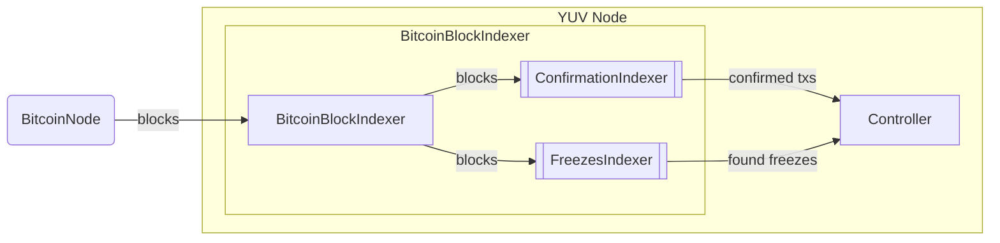
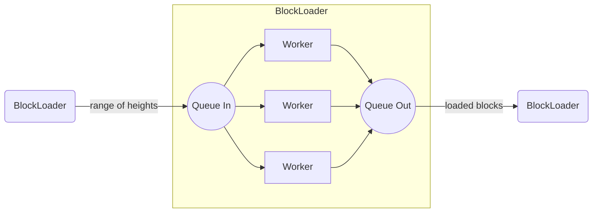

# `yuv-indexers`

Crate for indexers inside the YUV node. Provides entities for indexing the Bitcoin chain.

## [`BitcoinBlockIndexer`]

Provides the entity for polling blocks from the Bitcoin node that passes them to its
subindexers. Currently, they are:

1. [`ConfirmationIndexer`] - indexes transactions in blocks to find the matches with its internal
   list to pass the least number of confirmations (number of blocks that should pass
   after the transaction was mined).
2. [`AnnouncementsIndexer`] - indexes transactions for outputs with `OP_RETURN` to check whether
   it's
   YUV Announcement or not. If so, send it to the controller for a check.

[`BitcoinBlockIndexer`] has two main steps of execution:

1. `init` - initial rapid indexing of missed history, before other services have started
   (see [`BitcoinBlockIndexer::init`]).
3. `run` - the polling loop for new blocks that starts with other services (see
   [`BitcoinBlockIndexer::run`])

### Initial sync

[`BitcoinBlockIndexer::init`] is a method used for initial rapid block synchronization before the
polling process starts using [`BitcoinBlockIndexer::run`].  [`BitcoinBlockIndexer::init`]
starts [`BlockLoader`] internally. The scheme of their internal communication you can see below:

When [`BitcoinBlockIndexer`] sends to queue the load sequence (the range of blocks'
heights) [`BlockLoader`] requests workers to execute the task of fetching the block (currently
implemented through the Bitcoin node's JSON RPC API)

The main idea of `BlockLoader` is a manager of the `Workers`. The `BlockLoader` handles block chunks
and sequentially sends height from chunk to the `Workers`. Some `Worker` receives block height,
loads block with this height, and sends to the `BlockLoader`. The `Workers` receive unique block
height (they cannot receive the same block height, no broadcasting here).

When the chunk is loaded [`BlockLoader`] sends blocks to the [`BitcoinBlockIndexer`] which indexes
them.

#### Cancellation flow

When the [`BitcoinBlockIndexer`] receives a cancellation event, [`BlockLoader`] stops sending block
heights and
starts to listen for remaining blocks. By the time workers receive the cancellation event, they
finish handling of the tasks immediately. When [`BlockLoader`] receives all the remaining blocks it
sends a batch to the [`BitcoinBlockIndexer`] which indexes them.
