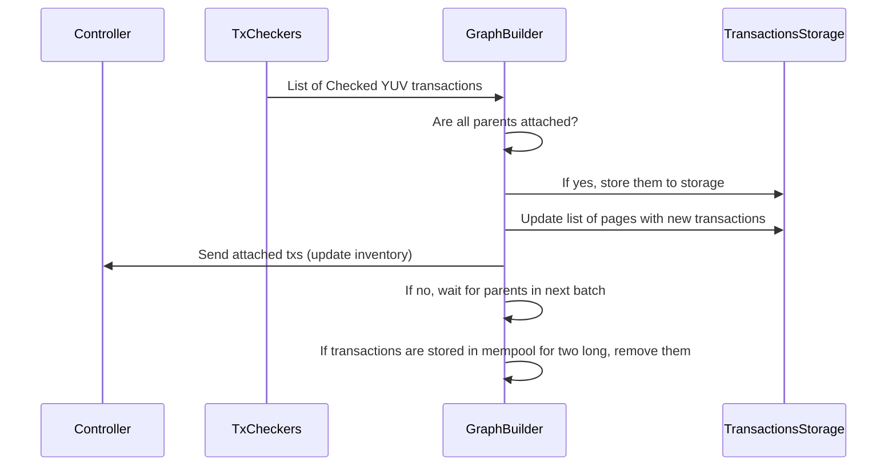
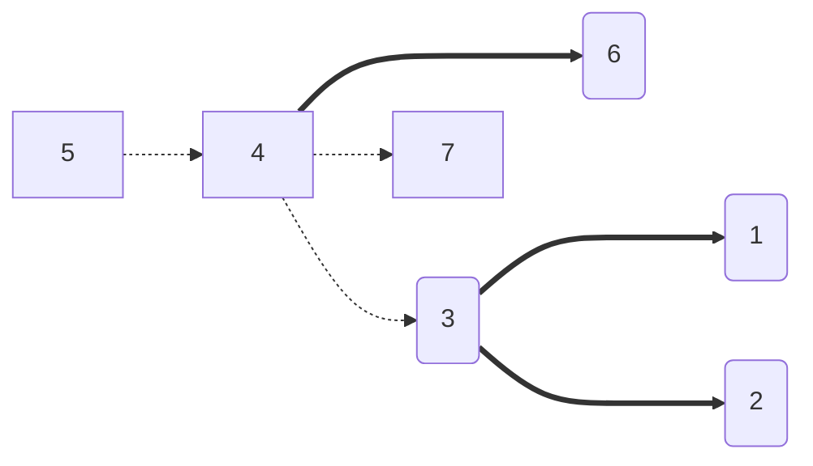
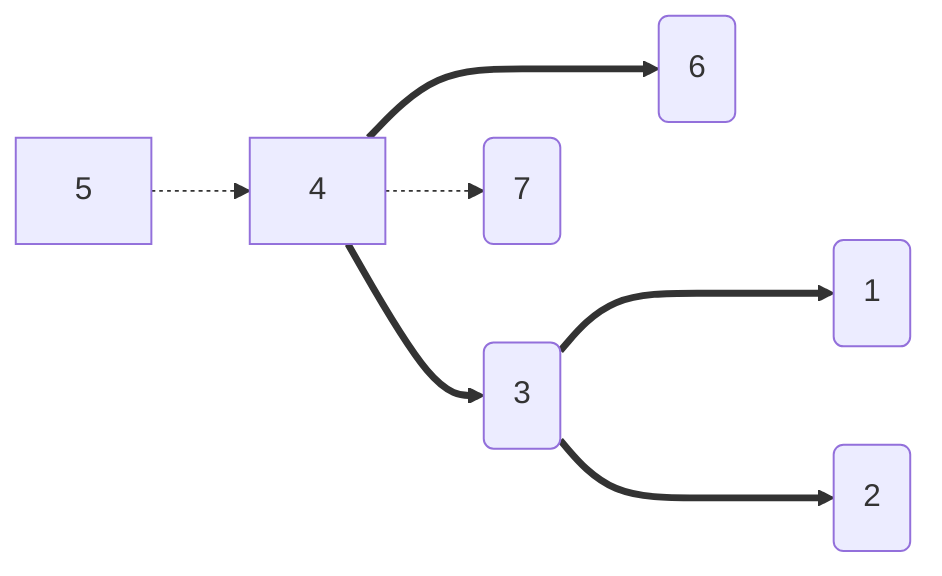
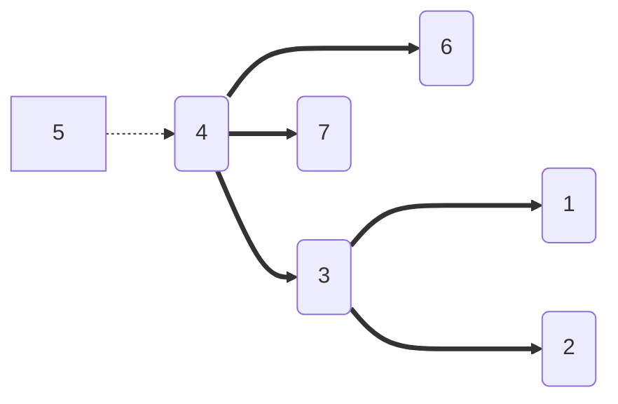
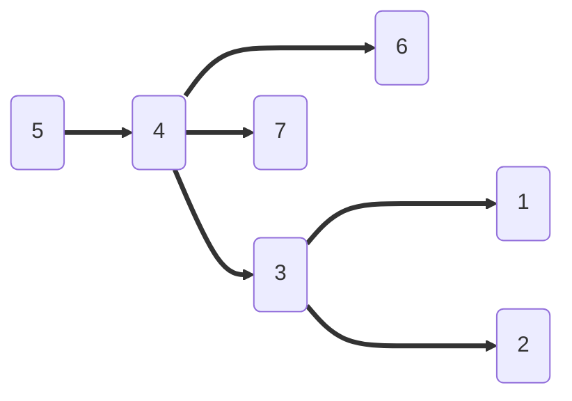

# `yuv-tx-attach`

Implementation of service inside a node which builds a graph of dependencies between
YUV transactions and stores ones that are considered "_attached_".

The transaction, in our case, is _considered attached_ when all of its history till
issuance is known and attached.

## Overview

This crate provides `GraphBuilder` entity that listens for transactions sent by
[`TxChecker`](../tx-check) to be checked for history validation (see the algorithm
below). The communication sequence diagram of GraphBuilder and other entities:



## Usage

`GraphBuilder` requires storage which implements some of the traits described in
[`yuv-tx-storage`](../storage), but for tests you can use `LevelDB::in_memory`
that already has all of that. Also, as `GraphBuilder` will send results of its
work to other services through [`EventBus`](../event-bus), `GraphBuilder` expects it to have
`ControllerMessage` and `GraphBuilderMessage` from [`yuv-types`](../types)
already registered.

```rust
use yuv_types::{ControllerMessage, GraphBuilderMessage};
use yuv_tx_attach::GraphBuilder;
use yuv_storage::LevelDB;
use event_bus::EventBus;

const TXS_PER_PAGE: u64 = 100;

# tokio_test::block_on(async {
let storage = LevelDB::in_memory().unwrap();

let mut event_bus = EventBus::default();
event_bus.register::<GraphBuilderMessage>(Some(100));
event_bus.register::<ControllerMessage>(Some(100));

let mut graph_builder = GraphBuilder::new(storage.clone(), &event_bus, 10);
# })
```

## Algorithm

Let $G = (V, E)$ - our oriented graph of dependencies between transactions,
where $V = \\{1, 2, 3, 6\\}$ are already attached transactions and $E = \\{ (3,
1), (3, 2)\\}$ are the dependencies between them. And we are accepting a batch of new
transactions $B = \\{7, 5, 4\\}$ in the same order with dependencies $\\{(4, 3), (4,
7), (5, 4)\\}$, so the graph will look like this:



Also, let's assume we have $Q$ - queue of transactions to be attached, $S$ -
a set of transactions that are currently in process of attachment, but we are
waiting for their dependencies to be attached, $D$ - a map of dependencies, and
$I$ - a map of inverse dependencies (where, in our case, $I\[7\] = \\{4\\}$, because
4 depends on 7).

So the algorithm will go as follows:

- For each transaction in $B$:
  - If transaction is **Issuance**, add it to $V$ (attached) and add to
      $Q$ all transactions that are depend on it from $I$.
  - If transaction is **Transfer**, iterate through each parent transaction
      and check if it's in $V$. If not, add edge to $D$ and $I$.
  - If all parents are attached add current transaction to $V$, remove entry
      from $D$, and add all transactions that are depend on it to $Q$ from $I$.
  - If not, add transaction to $S$.
- For each transaction in $Q$:
  - Get its all dependencies from $D$ and for each one check if it's in $V$,
    if so, remove it from $D$.
  - If dependencies of current transaction are empty, add it to $V$ and add all
    transactions that are depend on it to $Q$ from $I$, remove from $S$.

In our case, firstly we will iterate through $B$ and add 7 to $V = \\{1, 2, 3,
7\\}$ (as it's issuance):



As $I$ at this point is empty, we will go to next transaction (4). We will
add it's dependencies to $D$ and $I$. Check that all parent transactions are
in $V$, and that's why add 4 to $V$.



And the same will be for 5:


