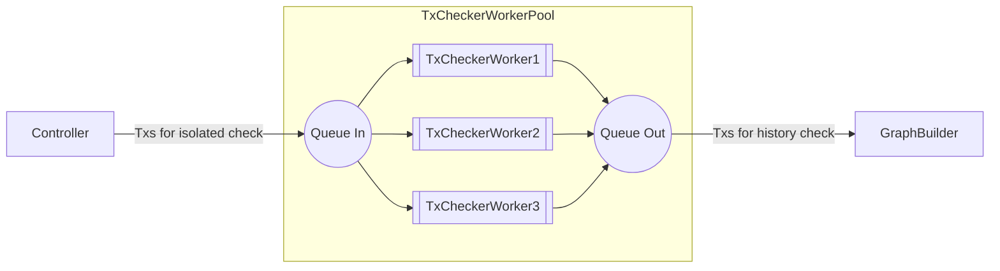
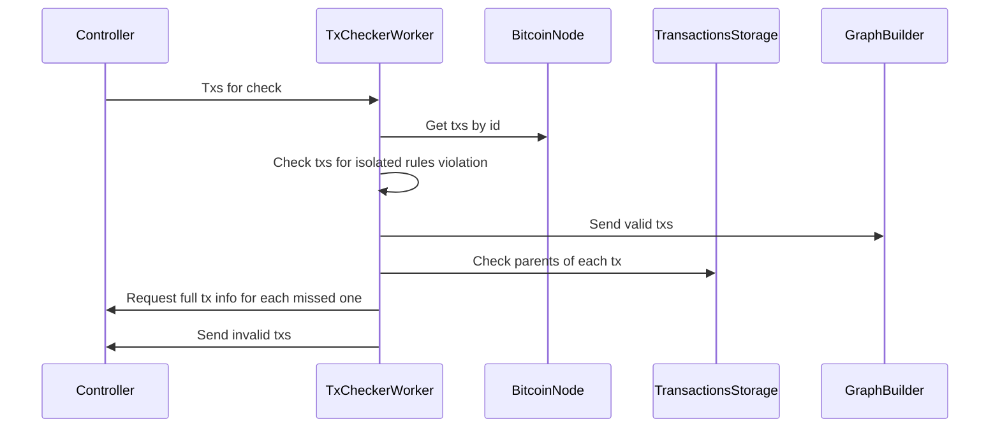

# `yuv-tx-check`

Provides functions and entities for isolated transactions checking.

_Isolated transaction check_ - is when for provided inputs and outputs given Bitcoin
transaction has correct data (proofs), and when transaction is not violating 
conservation rules.

## `check_transaction`

The main function in this crate is [`check_transaction`], which accepts a
`YuvTransaction` and returns an error if it violates any of the protocol rules
in isolation, without any external connection to network or database. That's why
for full validation of transaction's history, the tx should be also checked by
`GraphBuilder` from [`yuv-tx-attach`](../tx-attach).

[`CheckError`] - describes all possible errors that this functions may return.

## `TxChecker`

`TxChecker` - an abstract service, which is represented by [`TxCheckerWorkerPool`] and [`TxCheckerWorker`]s in this crate:

[`TxCheckerWorkerPool`] handles the start and finish of the [`TxCheckerWorker`]s.

[`TxCheckerWorker`] waits for the transaction checking events from `EventBus`.

Firstly, it checks that such a transaction exists by requesting it by id from
the Bitcoin node. Secondly, it uses [`check_transaction`] function for each tx.
Thirdly, as check for `freeze` transaction requires access to
`TransactionsStorage`, it checks them separately by retrieving the "frozen"
transaction and checking that the signer of the `freeze` is able to freeze the
target transaction (by comparing chroma of the target and signer's public key).

Then the valid transactions are sent to `GraphBuilder`. In case some of the
parents are missing in `TransactionStorage`, [`TxCheckerWorker`] sends message
to `Controller` about missing parents. If some of the transactions are invalid,
it sends message about them to `Controller`.

