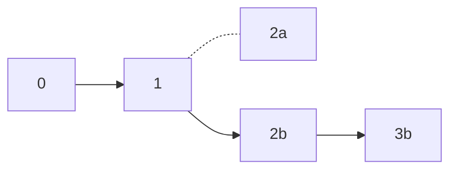

# `yuv-tx-confirm`

Provides functions and entities for confirmations and forks handling.

## Confirmations handling

Let's define `n` as the confirmation number. The `TxConfirmator` maintains the last `n` blocks in memory, let's call this list of blocks `RecentBlocks`. When a new block is received, there are two possible scenarios:

1) The last indexed block (`RecentBlocks[n-1]`) hash is equal to the next block's previous block hash: this indicates that the previously known blocks are still part of the current blockchain, and a new block can be added. In this case the first block of the `RecentBlocks` is now confirmed and should be sent to the [Controller](../controller/). The next block is added to the end of `RecentBlocks`, and the first block is popped so the `RecentBlock`s length doesn't exceed `n-1`.
2) The last indexed block (`RecentBlocks[n-1]`) hash is **NOT** equal to the next block's previous block hash: this indicates a reorganization (reorg) has occurred, and some of the blocks in `RecentBlocks` are now orphan blocks. Reorgs handling is described in the next section.

## Reorgs handling

In case of reorganization (reorg), the following algorithm is applied:

The previous hash of the new block is requested from the Bitcoin node and compared with `RecentBlocks[n-2]`, and so on, until a known block is found. The confirmator keeps track of the transactions that appeared in orphan blocks and then reprocesses them from scratch.

If no known block is found and `RecentBlocks` is empty, the YUV node is stopped as this fork cannot be handled.

### Example of reorg handling

Let's suppose `RecentBlocks` contains blocks `0->1->2a` and a reorg happened so the new chain looks like `0->1->2b->3b`:

We assume `2b->3b` is preffered over `2a` as it's longer. So when the `TxConfirmator` receives the `3b` block, it finds out that its previous block, `2b`, is not equal to `RecentBlocks[n-1]`, i.e. `2a`. So the confirmator marks the transactions inside of `2a` as orphan transactions and removes `2a` from `RecentBlocks`. Then it requests `2b` from the Bitcoin node and compares its prevhash, 1, to `RecentBlocks[n-2]`, i.e. 1 as well. These blocks match, so the reorg can be handled and the new chain is attached to the local list of blocks. As the result, the new blocks are indexed and transactions from the orphan blocks are handled from scratch.
