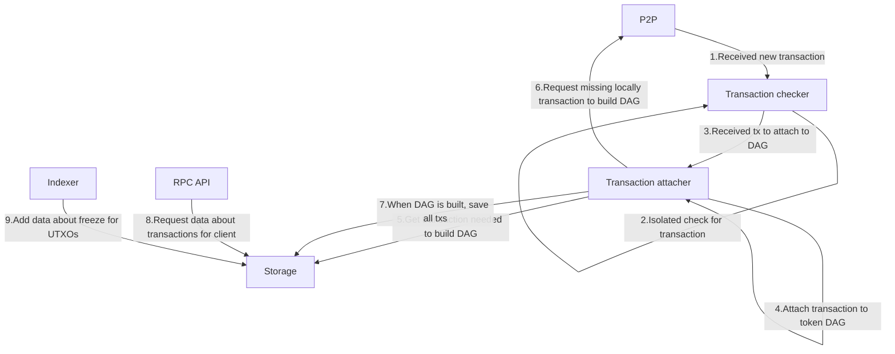
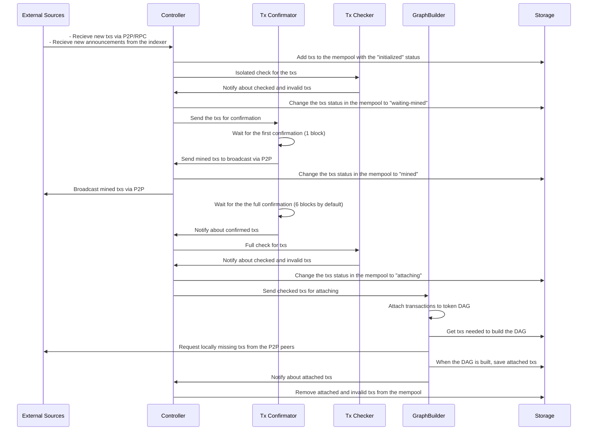

# YUV

## YUV protocol

YUV is a protocol for creating tokenized assets on top of the Bitcoin protocol (analogous to ERC-20 tokens with basic functions like issuance, transfer, freezing and burning).
YUV is an open protocol that utilizes Bitcoin as the base layer to move digital assets. Any Bitcoin node can become a YUV node by running the YUV software, YUVd. YUV nodes broadcast and process YUV transactions in a similar way to how Bitcoin nodes process bitcoin transactions.

Using the YUV protocol, an issuer can mint a stablecoin or issue other types of fungible tokens on Bitcoin, with the token type identified by the issuer through the issuer’s issuing key. Users can transfer these tokens – which we call YUVcoin – among each other without the issuer having to take action. 
The beauty of YUV lies in its open nature. You could just start a YUV node simply by running the YUVd software. This network of YUV nodes then works together, much like the Bitcoin network itself, to broadcast YUV transactions to bitcoin and validate YUV transactions.

The YUV protocol prioritizes compliance by allowing YUVcoin issuers to freeze assets for regulatory, legal, or compliance-related reasons. This freeze instruction is broadcasted to the Bitcoin network, ensuring YUV nodes will block transactions involving the specified assets.

## Development

* [YUV book]() - TODO
* [Developer notes]() - TODO
* [Productivity notes]() - TODO
* [Source code documention]() - TODO build rust book
* [Local development setup](../infrastructure/README.md) - How to set up and running local development network
* [CLI client](../apps/cli/) - CLI client up and running
* [Node](../apps/node/) - YUV node up and running
* [Desktop Wallet]() - TODO

## Architecture

Before we dive deep into architecture, there is a component that works like glue to connect all our components. It's an `Event bus`. All communication, except the communication to storage goes through the `Event bus`. 

Communication:
* [Bitcoin client](../crates/bitcoin-client/) - asynchronous wrapper on top of `bitcoincore-rpc`.
* [Controller](../crates/controller/) - message handler for P2P and RPC.
* [P2P](../crates/p2p/) - bitcoin P2P to broadcast YUV data (and in future, get all data from bitcoin through P2P).
* [RPC api](../crates/rpc-api/) - description of RPC api in Rust traits. Used to generate RPC client for wallets and as specification for backend implementation.
* [RPC server](../crates/rpc-server/) - implementation of RPC api.

Event bus:
* [Event bus](../crates/event-bus/) and [Event bus macros](../event-bus-macros/) - event bus implementation, utility crate which provides a simple interface for managing event channels between internal services. It provides you the ability to create the `EventBus` instance which can be used to publish events and subscribe to them.

Storage:
* [Storage](../crates/storage/) - Provides traits and implementations of storage for YUV transactions.
* [Indexers](../crates/indexers/) - indexer for bitcoin blocks for YUV protocol needs.

Transactions
* [Devkit](../crates/dev-kit/) - database, txbuilder, coin selection and wallet implementation for YUV transactions.
* [Transaction checker](../crates/tx-check/) - functions and entities for isolated transactions checking.
* [Transaction attacher](../crates/tx-attach/) - service inside node which builds graph of dependencies between YUV transactions and stores one that are considered "attached".

Types:
* [Pixels](../crates/pixels/) - types for cryptography implementation to YUV protocol.
* [Bulletproof](../crates/bulletproof/) - bulletproofs++ implementation for yuv transactions with hidden amount.
* [Types](../crates/types/) - utility types.

## Transaction flow

The flow of a YUV transaction received in any way is described by the following sequence diagram:

